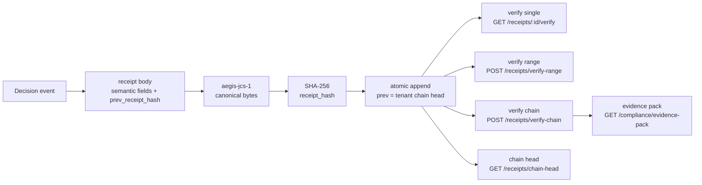

# Flow: Receipt Chain Verification

**Status: ✅ Implemented end-to-end.** How a canonical event becomes a chained receipt, and how anyone — including a third party — proves the history wasn't touched.



## Emit side (per protected decision)

1. **Build the body** — `receipt_body_value` (`src/src/routes/mod.rs`): `event_id, ts, agent_id, user_id, run_id, trace_id, tool, action, resource, source_trust, decision, approver, action_hash, prev_receipt_hash`. All strings/null — no float round-trip drift. Volatile `created_at` excluded.
2. **Canonicalize** — `aegis-jcs-1` (`src/canon/`): Unicode-sorted keys, compact separators, raw UTF-8, non-finite floats rejected.
3. **Hash** — `compute_receipt_hash` = SHA-256 of the canonical bytes.
4. **Chain** — `prev_receipt_hash` = current tenant chain head; append is transaction-safe under concurrent writers (`lib/storage/src/db/receipts.rs`).
5. **Sign (optional)** — Ed25519 over the `receipt_hash` string, stored alongside, never hashed (`src/src/sign.rs`). Unsigned is the hermetic default.
6. **Durability** — a protected decision that cannot record its receipt does not succeed (fail closed).

## Verify side

| Scope | How it works |
|---|---|
| Single receipt | rebuild body → recanonicalize → rehash → compare to stored `receipt_hash` |
| Range | above, plus each `prev_receipt_hash` must equal the predecessor's `receipt_hash` |
| Full chain | range from genesis; any break reports the exact receipt where integrity fails |
| Offline / third party | `aegis verify-receipts receipts.json` (`sdk-python/aegisagent/verify_receipts.py`) — no gateway trust needed; with signing, only the public key is needed |

Byte parity across gateway + Python + Go + TypeScript is pinned by `tests/receipt_chain_vectors.json` and `tests/canonical_action_vectors.json`, enforced in CI, and fuzzed (`canon-fuzz.yml`).

## What tampering looks like

- **Edited row** → its recomputed hash ≠ stored hash → single-verify fails.
- **Deleted / reordered row** → successor's `prev_receipt_hash` no longer matches → range-verify pinpoints the seam.
- **Truncated tail** → compare against an externally anchored `chain-head` snapshot (export heads periodically — see [../runbooks/receipt-chain-verification.md](../runbooks/receipt-chain-verification.md)).
- **Forged gateway** (claims different history) → signatures verified against the pinned public key fail.

## Example

```bash
curl -s -X POST $AEGIS/v1/receipts/verify-range \
  -H "Authorization: Bearer $TOKEN" \
  -d '{"from_id":"…","to_id":"…"}' | jq
aegis verify-receipts export.json && echo "chain intact"
```

## Related docs

[../action-receipt-spec.md](../action-receipt-spec.md) (normative) · [../components/Receipt_Engine.md](../components/Receipt_Engine.md) · [../adr/0003-aegis-jcs-1-canonicalization.md](../adr/0003-aegis-jcs-1-canonicalization.md) · [../adr/0004-ed25519-receipt-signing.md](../adr/0004-ed25519-receipt-signing.md) · [../runbooks/receipt-chain-verification.md](../runbooks/receipt-chain-verification.md)
