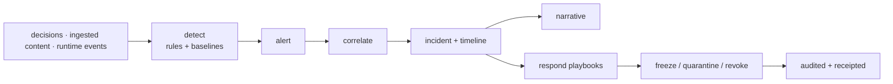

# Flow: SOC Incident

## Overview

One denial is noise. A pattern of denials is an attack. The SOC turns event streams into alerts, alerts into incidents with a narrative, and incidents into action — freeze, quarantine, revoke.

## Visual



## Step by step

1. Every decision (and ingested/runtime event) is emitted asynchronously — never blocking the authorize path (`lib/soc/src/events.rs`).
2. Detection rules fire (deny-storm, exfiltration pattern, MCP manifest drift, approval-hash-mismatch spikes) — built-ins plus a rule DSL (`lib/soc/src/detect.rs`, `rule_dsl.rs`).
3. Correlation groups related alerts into an **incident** with an evidence-linked timeline (`correlate.rs`).
4. A narrative is generated from the evidence (`narrate.rs`, `GET /v1/incidents/:id/narrate`).
5. An analyst investigates (`/dashboard`, `POST /v1/soc/query`, `GET /v1/graph/run/:id`) — or a playbook responds automatically (`respond.rs`).
6. Containment is enforced at authentication: the contained agent's calls fail closed.

## Why this matters

Every alert links back to hash-chained receipts — investigations end in proof, not screenshots.

## What can go wrong

SOC failure never changes an inline decision (isolation by design). Dead webhook destinations trip a circuit breaker (reactivate via `POST /v1/webhook_subscriptions/:id/reactivate`). Rules without time windows create alert storms — use the DSL's aggregation.

## Current status

Implemented for gateway evidence. Runtime event sources and enforcement coverage remain Partial.

## Example

```bash
curl -fsS http://127.0.0.1:8080/v1/incidents \
  -H "Authorization: Bearer tenant_123"
```

Use demo credentials only in the local seeded environment. Select an incident, inspect its graph, verify linked receipts, contain if required, and record a disposition before closure.

## Security

Detections and narration cannot authorize actions. Treat captured content as inert evidence, bind every query/response to tenant identity, preserve receipt hashes, and distinguish gateway freeze from complete host/network containment. SOC degradation is observable but never flips an inline deny to allow.

## Related code / docs

Code: `lib/soc/src/` · `src/src/routes/soc.rs` · `lib/storage/src/db/soc.rs`.
Docs: [../components/SOC_Engine.md](../components/SOC_Engine.md) (deep dive) · [Ban_Quarantine_Flow.md](Ban_Quarantine_Flow.md) · [../onboarding/For_SOC_Analyst.md](../onboarding/For_SOC_Analyst.md) · [../runbooks/index.md](../runbooks/index.md)
