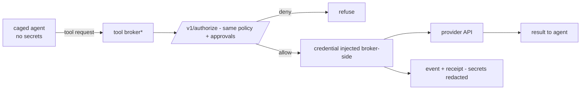

# Flow: Tool Broker

> **Status: Planned (Phase 6). No implementation files yet.** This page describes the target flow so the choke point has a stable home; the normative design is [../components/Tool_Broker.md](../components/Tool_Broker.md).

## Simple version

Caged agents never hold real credentials. When they need a tool, they ask the broker. The broker checks with Aegis, injects the credential on its own side, makes the call, and returns the result. A compromised agent has nothing to steal.

## Visual

## Step by step (target)

1. Sandbox provisioning gives the agent a broker endpoint + per-run scoped token — never provider keys.
2. The broker canonicalizes the request and calls the (already-implemented) authorize path.
3. Deny or missing approval → refuse, fail closed.
4. On allow, the broker injects the credential from its secret store and executes the call.
5. The call is evidenced like any SDK action — hashes and identifiers, never secret payloads.

## Why this matters

If the agent process holds an API key, one successful prompt injection owns that key forever. Credential isolation makes exfiltration structurally impossible for brokered calls.

## What exists today

The decision core it will call: policy, approvals, per-agent tool permissions (migration 0013), receipts — all Implemented. The broker service itself: Planned.

## Related docs

[../components/Tool_Broker.md](../components/Tool_Broker.md) · [Unknown_Agent_Cage_Flow.md](Unknown_Agent_Cage_Flow.md) · [../AegisAgent_Runtime_Data_Plane.md](../AegisAgent_Runtime_Data_Plane.md) · [../Implementation_Status.md](../Implementation_Status.md)
