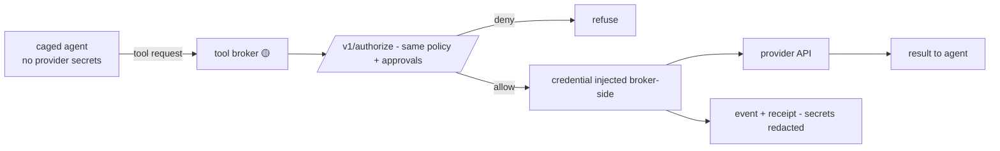

# Flow: Tool Broker

> **Status: Partial.** Broker core/connectors and the gateway execution route exist; standalone packaging and mandatory privileged-tool routing remain incomplete. Normative guide: [Tool Broker](../components/Tool_Broker.md).

## Overview

Caged agents never hold real credentials. When they need a tool, they ask the broker. The broker checks with Aegis, injects the credential on its own side, makes the call, and returns the result. A compromised agent has nothing to steal.

## Visual



## Step by step

1. Sandbox provisioning gives the agent a broker endpoint + per-run scoped token — never provider keys.
2. The broker canonicalizes the request and calls the (already-implemented) authorize path.
3. Deny or missing approval → refuse, fail closed.
4. On allow, the broker injects the credential from its secret store and executes the call.
5. The call is evidenced like any SDK action — hashes and identifiers, never secret payloads.

## Why this matters

If the agent process holds an API key, one successful prompt injection owns that key forever. Credential isolation makes exfiltration structurally impossible for brokered calls.

## What exists today

Policy, approvals, permissions, receipts, broker core/connectors, and `POST /v1/broker/execute` exist. A standalone service and a deployment that prevents direct privileged-provider access remain incomplete.

## Example

```bash
cargo test -p aegis-tool-broker-core
cargo test -p aegis-tool-broker-connectors
```

Acceptance additionally requires proving the workload cannot obtain the provider secret or bypass the broker.

## Security

Use typed allowlisted connectors, exact-action authorization and approval consume, scoped broker identity, destination validation, bounded timeouts/results, and redaction. Broker/secret-store failure denies privileged calls; arbitrary shell/URL connectors are forbidden.

## Related docs

[../components/Tool_Broker.md](../components/Tool_Broker.md) · [Unknown_Agent_Cage_Flow.md](Unknown_Agent_Cage_Flow.md) · [../AegisAgent_Runtime_Data_Plane.md](../AegisAgent_Runtime_Data_Plane.md) · [../Implementation_Status.md](../Implementation_Status.md)
