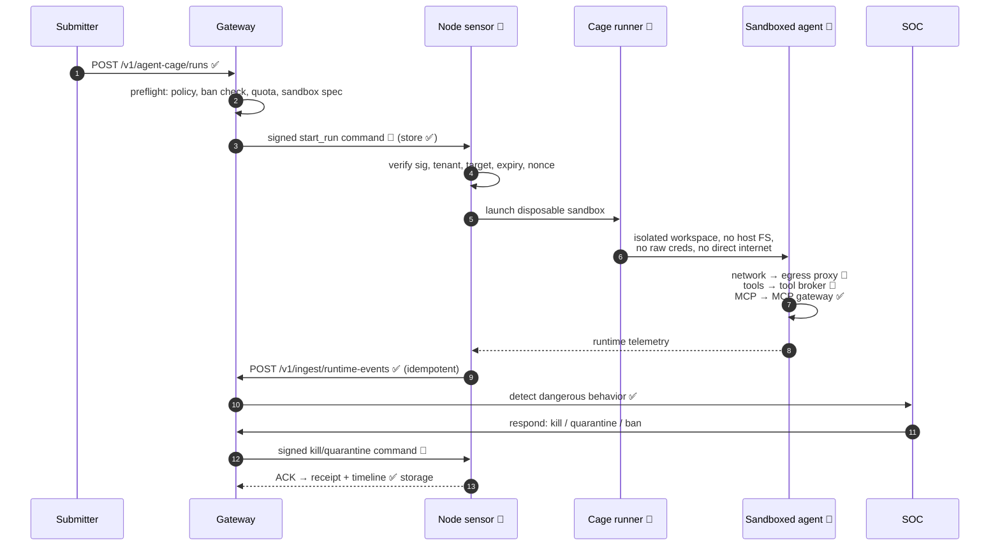

# Flow: Anonymous Agent in the Cage

**Status: 🟡 control-plane APIs + storage implemented; sandbox execution 📐 designed (Phases 3–6).** Steps marked ✅ work at HEAD today; steps marked 📐 are target design from [../AegisAgent_Agent_Cage.md](../AegisAgent_Agent_Cage.md) and [../AegisAgent_Runtime_Data_Plane.md](../AegisAgent_Runtime_Data_Plane.md).

## What works today (✅ at committed HEAD)

| Step | API / code |
|---|---|
| Register a controlled run | `POST /v1/agent-cage/runs`, `GET /v1/agent-cage/runs[/:id]` — `src/src/routes/runtime.rs` (#1681), store `lib/storage/src/db/agent_runs.rs` (migration 0026). *Route file under reorganization on an active branch — verify before deep-linking.* |
| Ingest runtime events (idempotent) | `POST /v1/ingest/runtime-events` — store `db/runtime_events.rs` (0027) |
| Read a run's runtime timeline | `GET /v1/runtime/runs/:id/events` |
| Persist control commands | `lib/storage/src/db/control_commands.rs` (0028) — **storage only**; no signing/dispatch yet |
| Bans / quarantine records | `db/agent_bans.rs` (0029, #1678), `db/quarantine.rs` (0030, #1679) |
| SOC detection over ingested events | `lib/soc/src/*` |

## What the design adds (📐)

1. **Node sensor (Phase 3):** registration, durable local queue, command polling + verification, typed enforcement handlers — [../components/Node_Sensor.md](../components/Node_Sensor.md).
2. **Cage runner (Phase 4):** Docker-first disposable sandbox — isolated workspace, no Docker socket, no host filesystem, seccomp/least-privilege; gVisor/Firecracker/Kata later — [../AegisAgent_Agent_Cage.md](../AegisAgent_Agent_Cage.md).
3. **Egress proxy (Phase 5):** observe/enforce/lockdown network modes — [../components/Egress_Proxy.md](../components/Egress_Proxy.md).
4. **Tool broker (Phase 6):** credential isolation — [../components/Tool_Broker.md](../components/Tool_Broker.md).
5. **Signed control commands end-to-end:** `aegis-command-jcs-1` canonical signing, nonce/expiry/tenant/target binding, ACK/NACK — [../AegisAgent_Control_Command_Protocol.md](../AegisAgent_Control_Command_Protocol.md), [Control_Command_Flow.md](Control_Command_Flow.md).

## The security argument

The cage doesn't try to out-argue a hostile agent — it removes the ambient environment. Filesystem, network, secrets, tools, and MCP all *only* work through Aegis choke points, so "bypassing Aegis" means "having nothing to act with." Dangerous behavior that is attempted anyway becomes runtime events → detections → kill/quarantine/ban, each step receipted.

## Related docs

[../AegisAgent_Agent_Cage.md](../AegisAgent_Agent_Cage.md) · [../AegisAgent_Runtime_Data_Plane.md](../AegisAgent_Runtime_Data_Plane.md) · [../flows/Ban_Quarantine_Flow.md](../flows/Ban_Quarantine_Flow.md) · [../Implementation_Status.md](../Implementation_Status.md) · roadmap [../AegisAgent_Phased_PR_Plan.md](../AegisAgent_Phased_PR_Plan.md)
