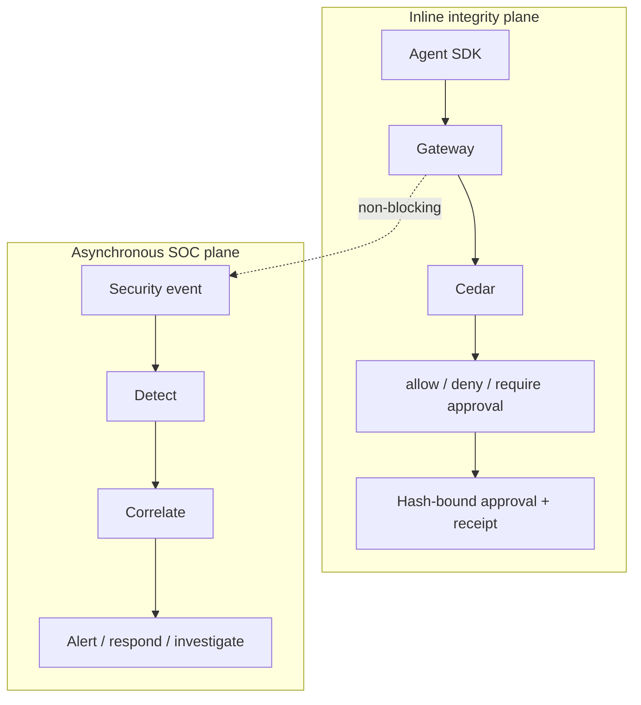

# Getting started

This page is the quickest path to understanding AegisAgent: what it is, its components, the
architecture, and the use cases it targets.

## Overview

Start with the proof demo, then choose an SDK and deployment path. Do not begin by exposing the gateway publicly or deploying partial runtime components as if they were complete enforcement.

> **Status:** The known-agent quickstart is implemented. Unknown-agent cage/sensor/egress/broker force paths and multi-replica HA remain Partial.

## Why This Exists

The safest learning path proves enforcement before adding deployment complexity. You should understand what is blocked, why it is blocked, and how the evidence verifies before connecting production credentials.

## What AegisAgent is

AegisAgent is the **integrity layer for AI agent actions**, delivered as an **integrity-anchored
Agent SOC**. It sits at the tool-call boundary — standalone or layered onto a gateway you already
run — and guarantees what competitors only decide:

1. **The human-approved action is the action that executes.** The exact action is frozen, SHA-256
   hashed, and the approval is bound to that hash; the SDK fails closed on any mismatch, replay, or
   expiry.
2. **Untrusted-origin content cannot drive a privileged action.** A deterministic 6-level
   source-trust label is a first-class policy input.
3. **Every decision is provable.** A hash-chained, verifiable receipt is emitted for each action and
   streamed into a SOC that detects, correlates, contains, and proves.

## Components

| Component | Role |
|---|---|
| **Gateway** (Rust + Axum) | The runtime: thin adapters call `lib/decision` to authorize every action with Cedar, manage approvals, write receipts, emit SOC events. Binds `127.0.0.1:8080` in dev. |
| **Policy engine** (Cedar) | Deterministic authorize outcomes (`allow` / `deny` / `require_approval`, plus annotations such as `redact` / `quarantine`); provenance + approval gates live in `policies.cedar`. |
| **SDKs** | In-agent interception. Python and TypeScript integrity paths are production-ready; Go is beta with documented capture-parity gaps. |
| **Approval integrity engine** | Freeze → hash → bind → single-use consume → fail-closed. |
| **Trust-provenance gate** | The 6 deterministic source-trust levels. |
| **Verifiable receipts** | Hash-chained, tamper-evident evidence + reference verifier + CLI (`aegis-verify-receipts`). |
| **MCP Gateway Lite** | Register / discover / pin MCP tools; manifest-drift detection. |
| **Agent SOC** | Implemented async detection/correlation/incidents and a beta console; runtime force-path response remains Partial. |

## Architecture at a glance

AegisAgent runs two planes:

The inline plane decides and enforces in real time; the SOC plane monitors and responds out-of-band
and **never** adds latency to the action path. See the [Technical design](AegisAgent_Technical_Design.md)
for the full picture and the [Agent SOC design](AegisAgent_Agent_SOC_Design.md) for the monitoring plane.

## Use cases

- **Guard high-risk agent actions** — merge to main, deploy, IAM changes, refunds, customer-data
  export, prod DB writes — with provably-correct human approval.
- **Defend against indirect prompt injection** — deterministically deny mutating actions triggered by
  untrusted external content (the confused-deputy attack).
- **Prove human oversight** — export verifiable receipts for SOC 2 and EU AI Act Article 14.
- **Run a SOC for your agents** — detect, correlate, and contain across a whole agent run, with
  provable incident timelines.
- **Govern an agent fleet** — track AI agents as a [digital workforce](AegisAgent_Agent_Workforce_Governance.md).

## Next steps

1. **[Install the gateway](installation.md)** and run the zero-setup demo.
2. **[Connect an agent](AegisAgent_Integration_Connectivity.md)** — choose inline SDK, proxy, or agentless.
3. Explore the **[Agent SOC](AegisAgent_Agent_SOC_Design.md)** and the **[Console UI](AegisAgent_SOC_UI_Design.md)**.
