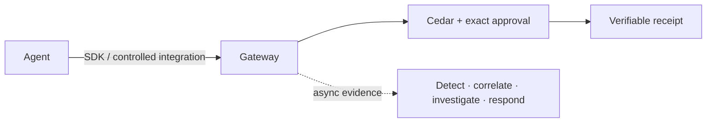

---
hide:
  - navigation
  - toc
---

# AegisAgent documentation

**The integrity layer for AI agent actions — delivered as an integrity-anchored Agent SOC.**
Open, self-hostable, framework-neutral.

!!! quote ""
    *Make the approval trustworthy. Trust the source, not the text. Run the SOC on the proof.*

## Overview

AegisAgent checks an agent's proposed action before execution, binds required approval to the exact canonical action, produces verifiable evidence, and operates a deterministic SOC on that evidence.

> **Status:** Known-agent integrity and gateway-evidence SOC capabilities largely ship today. Unknown-agent runtime force paths and multi-replica enterprise operations remain Partial. See [Implementation Status](Implementation_Status.md).

## Why This Exists

AI agents act with real credentials on real systems. Permission without source provenance, exact-action approval, and independently verifiable evidence creates false assurance. AegisAgent provides those controls at deployable action choke points.

-   :material-rocket-launch:{ .lg .middle } **Getting started**

    ---

    What AegisAgent is, its components, and how the architecture fits together.

    [:octicons-arrow-right-24: Overview](getting-started.md)

-   :material-download:{ .lg .middle } **Installation**

    ---

    Deploy the gateway and run your first protected action in minutes.

    [:octicons-arrow-right-24: Install](installation.md)

-   :material-lan-connect:{ .lg .middle } **Integration & connectivity**

    ---

    Connect agents from anywhere — inline SDK, proxy, or agentless.

    [:octicons-arrow-right-24: Connect agents](AegisAgent_Integration_Connectivity.md)

-   :material-shield-search:{ .lg .middle } **The Agent SOC**

    ---

    Detect, correlate, contain, and **prove** every agent action.

    [:octicons-arrow-right-24: SOC design](AegisAgent_Agent_SOC_Design.md)

-   :material-account-group:{ .lg .middle } **Agent workforce**

    ---

    Govern your AI agents as a digital workforce — directory, lifecycle, fleet.

    [:octicons-arrow-right-24: Workforce governance](AegisAgent_Agent_Workforce_Governance.md)

-   :material-file-certificate:{ .lg .middle } **Action receipts**

    ---

    The open, hash-chained verifiable-evidence format.

    [:octicons-arrow-right-24: Receipt spec](action-receipt-spec.md)

-   :material-database-search:{ .lg .middle } **Qdrant integration**

    ---

    Semantic audit log indexing and vector search.

    [:octicons-arrow-right-24: Qdrant guide](qdrant-integration.md)

## What is AegisAgent?

AI agents now take real actions across company systems. A market of gateways can already *decide*
whether an action is allowed — that part is commodity. AegisAgent makes those decisions **trustworthy**
and **provable**, and operates a SOC on the resulting evidence.

It is built on three things a generic gateway or SIEM can't copy:

- **Approval integrity** — every human approval is bound to a SHA-256 hash of the *exact frozen action*; the SDK **fails closed** if a different, edited, expired, or replayed action would execute.
- **Deterministic trust-provenance gating** — authorization is gated on the *source trust level* of the triggering content (6 levels), not a guessable text score.
- **Verifiable, hash-chained action receipts** — tamper-evident evidence for SOC 2 / EU AI Act Article 14, and the spine of the Agent SOC.

## How it fits together

Start with **[Integration & connectivity](AegisAgent_Integration_Connectivity.md)** to connect your first
agent, or **[Installation](installation.md)** to stand up the gateway.
