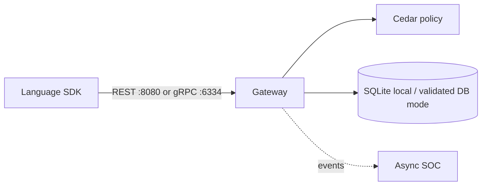

# Installation

AegisAgent is self-hostable and runs as a single Rust gateway plus a language SDK. This page gets you
from zero to a verified protected action.

> **Status:** Native, Docker Compose, and single-replica Helm paths are available. Multi-replica production HA and complete runtime-control force paths remain Partial.

## Overview

Choose the smallest installation that proves your objective: the in-process integrity demo for concepts, the native gateway for development, Docker Compose for the full local proof, or Helm for a controlled single-replica deployment.

## Why This Exists

Installation is part of the security model. A process that starts without authentication, durable evidence, correct policy, or a supported storage topology is not a successful production installation.

## Architecture



The local path defaults to loopback. Production exposure adds TLS, enforced authentication, durable storage, metrics, backups, and tested rollback.

## Requirements

- **Rust** (stable) for the gateway
- **Python 3.8+** for the reference SDK and demos
- *(optional)* **Docker + Docker Compose** for the local stack

## Option A — zero-setup demo (no gateway needed)

The fastest way to see approval integrity working end-to-end:

```bash
python3 -m venv .venv
. .venv/bin/activate
python -m pip install -e "sdk-python[dev]"
python examples/integrity_demo.py
```

This runs the frozen-action approval + fail-closed-on-swap flow entirely in-process.

## Option B — run the gateway

```bash
# build & test
cargo check --workspace
cargo test --workspace -- --test-threads=1

# run (binds 127.0.0.1:8080)
CEDAR_POLICY_PATH=policies.cedar cargo run -p gateway --bin gateway

# health check
curl -s http://127.0.0.1:8080/health
```

Install the SDK and point it at the gateway:

```bash
python -m pip install -e "sdk-python[dev]"
python -m unittest discover -s sdk-python/tests
```

## Option C — local stack (Docker)

```bash
make demo
```

This brings up the gateway with seeded agents/tools, runs the malicious-GitHub
issue demo, runs the approve-then-swap demo, and verifies the persisted receipt
chain. It proves that untrusted external input cannot drive a mutating merge
action, the approval binds to the original `action_hash`, swapped parameters fail
closed, replay is blocked, and receipt evidence is inspectable.

Manual equivalent:

```bash
docker compose up --build -d
bash scripts/seed-demo.sh
python3 examples/github-attack-demo.py
python3 examples/approve_then_swap_demo.py
curl -fsS -X POST \
  -H "Authorization: Bearer tenant_123" \
  -H "Content-Type: application/json" \
  -d '{}' \
  http://127.0.0.1:8080/v1/receipts/verify-range
```

## Verify a receipt

Every protected action emits a hash-chained receipt. Verify a receipts file independently:

```bash
aegis-verify-receipts <receipts.json>
# or:  python3 -m aegisagent.verify_receipts <receipts.json>
```

## Bind interface

For development and testing the gateway binds the loopback interface (`127.0.0.1`). For production,
front it with TLS and expose it on a controlled endpoint your agents can reach (see
[Integration & connectivity](AegisAgent_Integration_Connectivity.md) §4 for network and auth).

## Security and Verification

- Keep `127.0.0.1` for local development.
- Require TLS and production authentication before public binding.
- Treat seeded `tenant_123` credentials as demo-only.
- Verify `/startupz`, `/readyz`, one protected action, and receipt integrity.
- Do not scale the default SQLite/PVC topology beyond one writer.

## Troubleshooting

Run `make doctor`, check port `8080`/`6334` availability, inspect `docker compose logs gateway`, verify `src/policies.cedar` exists for native startup, and confirm storage permissions. Use [Debugging Guide](AegisAgent_Debugging_Guide.md) for deeper failures.

## Next steps

- **[Connect your first agent](AegisAgent_Integration_Connectivity.md)** — inline SDK, proxy, or agentless.
- Write policies — the deterministic gates live in `policies.cedar`.
- Read the [Operational design](AegisAgent_Operational_Design.md) for SLOs and fail-closed behavior.
- Ready for production? See the **[Deployment guide](deployment-guide.md)** for Docker Compose, Kubernetes (Helm), bare metal, the full environment variable reference, and capacity planning.
