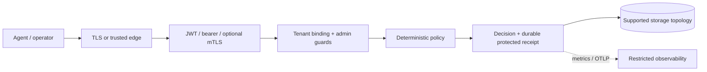

# Production hardening & configuration reference

Operator-facing reference for the security/reliability controls added in the
June 2026 hardening pass. Pairs with [`deployment-guide.md`](deployment-guide.md)
(how to deploy) and [`performance-tuning-guide.md`](performance-tuning-guide.md)
(throughput knobs). Everything here is read once at startup unless noted.

> **Status:** Production-hardened for the known-agent, single-writer gateway path. PostgreSQL/multi-replica operations, complete runtime enforcement, and native human OIDC/SAML remain Partial or Planned; see [Implementation Status](Implementation_Status.md).

## Overview

Hardening protects four boundaries: network entry, authenticated tenant identity, deterministic authorization, and durable evidence. Use this checklist before exposing the gateway beyond loopback and after every material deployment, identity, policy, storage, or signing change.

## Why This Exists

A correct Cedar policy cannot compensate for an unauthenticated public listener, replay state that is not shared correctly, missing receipt durability, leaked secrets, or an unsupported database topology. Hardening converts secure code paths into a secure operating system.

## Architecture



Hardening must preserve every boundary. Public traffic must not reach policy anonymously; protected decisions must not bypass durable evidence; diagnostics must not expose tenant identifiers or secrets.

## 1. Authentication mode (safe by default)

| Env var | Default | Effect |
|---|---|---|
| `AEGIS_JWT_REQUIRED` | `false` | When `true`, `/v1/*` requires a valid JWT; the `tenant_`-prefixed bearer fallback is disabled and `AEGIS_JWT_SECRET` must be set to a real (non-empty, non-`default_secret`) value or startup fails. |
| `AEGIS_JWT_SECRET` | — | Single secret or comma-separated list (zero-downtime rotation). Empty/`default_secret` entries are ignored. |
| `AEGIS_DEMO_MODE` | `false` | Allows a non-loopback bind without JWT (see §2). Logged loudly as *running without enforced auth*. Never use in production. |

## 2. Public-bind safety (fail closed)

The gateway **refuses to start** if `AEGIS_BIND_ADDR` is a non-loopback
(network-reachable) address while authentication is not enforced — a public
bind without JWT is effectively unauthenticated, because the tenant extractor
would accept any `tenant_`-prefixed token.

- Loopback binds (`127.0.0.1`, `::1`, `localhost`) — always allowed (dev/test default).
- Non-loopback bind → set `AEGIS_JWT_REQUIRED=true` (production) **or**, for an
  explicit insecure/demo box, `AEGIS_DEMO_MODE=true`. Otherwise startup aborts
  with a clear error.

## 3. Admin / diagnostics endpoint gating

`/metrics`, `/debug/runtime`, `/admin/db-stats`, and `/admin/backup` are guarded:

- **Loopback bind** → allowed (local ops).
- **Non-loopback bind** → require `X-Aegis-Admin-Key` matching `AEGIS_ADMIN_API_KEY`.
  If no admin key is configured, these endpoints are **disabled (403)** rather
  than left open. Keys are compared as SHA-256 digests (no timing side-channel).

| Env var | Default | Effect |
|---|---|---|
| `AEGIS_ADMIN_API_KEY` | — | Required to reach admin/diagnostic endpoints on a non-loopback bind. |

## 4. Replay protection

Per-request replay protection is opt-in (only when the caller sends a `nonce`),
combining a ±5-minute timestamp window with `(tenant, agent, nonce)` dedup.

| Env var | Default | Effect |
|---|---|---|
| `AEGIS_REPLAY_STORE` | `memory` | `db` uses the durable, shared `replay_nonces` table — replay-safe across restarts and **multiple gateway instances**. `memory` is a per-process LRU (single-node only). |
| `AEGIS_REPLAY_NONCE_CACHE_CAPACITY` | `10000` | In-memory store capacity (`0` disables). |

If the configured store is unreachable, the gateway **fails closed** (rejects
the request) rather than silently accepting a possibly-replayed one. Use `db`
for any multi-instance deployment.

## 5. Receipt durability (evidence is fail-closed for protected actions)

Every decision emits a hash-chained action receipt. **Protected** decisions —
any mutating action, `high`/`critical` risk, or any non-`allow` decision
(`deny`/`require_approval`/`quarantine`/`redact`) — write their receipt
**synchronously before responding**, and the `/v1/authorize` response carries
the receipt identity:

```json
"receipt": { "receipt_id": "...", "receipt_hash": "...",
             "prev_receipt_hash": "...", "canon_version": "aegis-jcs-1" }
```

If a protected decision's receipt cannot be durably written, the gateway returns
`500` — a protected action is never reported authorized without verifiable
evidence. Low-risk read-only `allow`s use a best-effort async write.

## 6. Receipt verification endpoints

| Endpoint | Purpose |
|---|---|
| `GET /v1/receipts/:id/verify` | Recompute one receipt's hash and compare. |
| `POST /v1/receipts/verify-chain` | Verify a caller-supplied receipt list. |
| `POST /v1/receipts/verify-range` | Verify a bounded `[from,to]` slice of the tenant's own persisted chain. |
| `GET /v1/receipts/chain-head` | Current chain tip (id/hash/prev/canon_version) for anchoring. |

All tenant-scoped.

## 7. SOC query API

`POST /v1/soc/query` — structured, tenant-scoped query for the SOC console.
`entity` + `aggregate` are allowlists; unknown entities/aggregates/JSON fields
are rejected; filters map only to parameterized queries (no raw SQL). Current
entities: `decision` and durable Agent Security Events (`ase`). Supported
aggregations are `none`, `count`, `count_over_time`, and bounded `count_by`.
All time filters must be RFC3339 timestamps; UI relative tokens such as
`now-24h` are resolved client-side before this endpoint is called.

## 8. Production hardening checklist

- [ ] `AEGIS_JWT_REQUIRED=true` and a real `AEGIS_JWT_SECRET`.
- [ ] `AEGIS_ADMIN_API_KEY` set (admin/metrics/debug reachable only with it).
- [ ] `AEGIS_REPLAY_STORE=db` for multi-instance deployments.
- [ ] `AEGIS_DEMO_MODE` unset/false.
- [ ] TLS configured (`AEGIS_TLS_CERT`/`AEGIS_TLS_KEY`) or TLS-terminating proxy.
- [ ] Receipt signing key configured if transparency anchoring is required.
- [ ] Backups + retention reviewed (see `deployment-guide.md`).
- [ ] Multi-replica only with PostgreSQL `DATABASE_URL` (Helm fails closed on SQLite scale-out — `helm/aegis-gateway/templates/validate-backend.yaml`).
- [ ] Gateway image built with `--features postgres` when `DATABASE_URL` is Postgres.

## 9. Enterprise console auth: JWT-only (no native OIDC yet)

**Honest limitation (Wave B):** the gateway and console do **not** embed an
OIDC/SAML client. Production human auth is:

1. **JWT** — set `AEGIS_JWT_REQUIRED=true` and issue HS256 (or configured)
   tokens from your identity system, **or**
2. **Edge SSO** — put an Identity-Aware Proxy / OAuth2-proxy / API gateway
   that terminates OIDC in front of the Helm Service and injects or mints
   the gateway JWT, **or**
3. **Agent mTLS / bearer** for machine principals (`AEGIS_MTLS_CA_CERT`, agent
   tokens) — not a substitute for human SSO.

Do **not** market “native Okta/Azure AD login in the Aegis console” until
Phase 10.1 lands. The production Helm profile
(`helm/aegis-gateway/values-production.yaml`) enables `jwtRequired: true`
and multi-replica Postgres assumptions.

## 10. PostgreSQL multi-replica (validation path)

| Mode | `DATABASE_URL` | `replicaCount` | Notes |
|---|---|---|---|
| Dev / single-writer | `sqlite:///data/aegis.db` | `1` only | Default chart; PVC RWO |
| Production HA candidate | `postgres://…` or `postgresql://…` | `≥2` only in a validated environment | Use `values-production.yaml`; disable SQLite PVC; `AEGIS_REPLAY_STORE=db`; do not claim supported HA until the release ledger marks Postgres GA |

Compile the gateway with the workspace `postgres` feature when using Postgres.
Migrations live under `lib/storage/migrations_postgres/`. SQLite remains the
local/dev path.

## 11. Data-plane packaging (Wave B)

| Binary | Dockerfile | Helm | Compose (full) |
|---|---|---|---|
| gateway | yes | `helm/aegis-gateway` | yes |
| node-sensor | yes | `helm/aegis-node-sensor` | yes |
| egress-proxy | yes | `helm/aegis-egress-proxy` | yes |
| llm-gateway | yes (`bins/aegis-llm-gateway/Dockerfile`) | `helm/aegis-llm-gateway` | yes |
| cage-runner | yes (`bins/aegis-cage-runner/Dockerfile`) | `helm/aegis-cage-runner` | yes (`--profile cage`; mounts host `docker.sock` — see `docs/AegisAgent_Cage_Docker_Security.md`) |

## 12. Security Verification

After hardening, verify negative cases as well as health:

```bash
curl -i http://127.0.0.1:8080/readyz
curl -i http://127.0.0.1:8080/metrics
```

The first request should match deployment readiness. The second must be rejected without the required admin authorization in a hardened configuration. Also test invalid JWT, wrong tenant, replayed nonce, expired approval, swapped action hash, oversized body, and protected receipt persistence failure in a non-production environment.

Never treat a successful liveness probe as proof that authentication, tenant isolation, policy, approvals, receipts, or background evidence writers are correct.

## 13. Operations and Recovery

Record configuration without secret values, policy hash, image digest, schema version, and receipt-chain head at every release. Alert on readiness, hash mismatch, replay, protected receipt failure, receipt integrity, SOC event drops, database saturation, and secret/exporter health.

If a hardening change blocks legitimate traffic, prefer rolling back the specific configuration/image under controlled maintenance over disabling authentication or fail-closed behavior. After rollback, verify identity, authorization, protected receipt creation, and chain integrity.

## 14. References

- [Deployment Guide](deployment-guide.md)
- [Fail-Closed Behavior](fail-closed-behavior.md)
- [Threat Model](AegisAgent_Threat_Model.md)
- [Secret Rotation](runbooks/secret-rotation.md)
- [Backup and Restore](runbooks/backup-and-restore.md)
- [Implementation Status](Implementation_Status.md)
