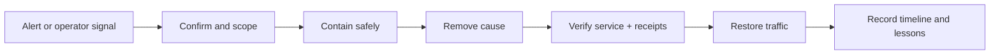

# Operational Runbooks

> **Status:** Current runbook index for implemented known-agent and SOC operations. Runtime-control procedures apply only where the corresponding component is deployed and marked Implemented/Partial in [Implementation Status](../Implementation_Status.md).

## Overview

Runbooks are step-by-step incident procedures. They turn an alert into a safe sequence: identify the symptom, confirm scope, contain impact, recover service, verify evidence, and record lessons learned.

**Tracking issue:** [#1199](https://github.com/lavkushry/AegisAgent/issues/1199)

## Incident Workflow



Containment comes before convenience. Verification includes both service health and evidence integrity when protected actions may be affected.

## Runbook Selection

Step-by-step procedures for the most common SOC scenarios. Each follows the same shape: **Symptoms** (how you'd notice this), **Investigation** (how to confirm and scope it), **Remediation** (what to do about it), **Verification** (how to confirm it's actually resolved).

| Runbook | Use when |
|---|---|
| [Deny storm](deny-storm.md) | An agent accumulates repeated denied actions in a short window — likely misconfiguration or active probing. |
| [Data exfiltration pattern](data-exfiltration.md) | A read action is followed by an external write/send for the same agent — the confused-deputy exfil pattern. |
| [Agent token rotation](agent-token-rotation.md) | A token may have leaked, or you need to rotate one proactively. |
| [Backup and restore](backup-and-restore.md) | Before a risky migration, or recovering from corruption/accidental deletion. |
| [Receipt chain verification](receipt-chain-verification.md) | Confirming the evidence trail hasn't been tampered with — routine compliance prep or post-incident verification. |
| [Secret rotation](secret-rotation.md) | Routine or post-exposure rotation of `AEGIS_JWT_SECRET` or `AEGIS_RECEIPT_SIGNING_KEY` — process-wide secrets, not a specific agent's token. |

These assume familiarity with the SOC architecture in [`AegisAgent_Agent_SOC_Design.md`](../AegisAgent_Agent_SOC_Design.md) (the Four Design Laws, autonomy levels `L0`–`L4`) and the [evidence graph](../evidence-graph.md) query API used throughout for investigation.

## Example Invocation

When receipt integrity alerts, begin with the verification runbook rather than editing the database:

```bash
python3 -m aegisagent.verify_receipts receipts.json
```

Preserve the original evidence file and command output. Do not “repair” a broken chain before forensic capture.

## Security and Safety

- Authenticate and authorize every containment or rotation action.
- Bind all investigation queries to the affected tenant.
- Never paste tokens, signing keys, unredacted prompts, or sensitive parameters into tickets or chat.
- Prefer reversible containment—freeze or quarantine—before destructive cleanup.
- Do not weaken fail-closed SDK or policy behavior to restore availability.
- Preserve receipt, audit, and runtime evidence before mutation.

## Operations

Each production alert must link to one runbook and name an owner. Exercise backup/restore, receipt verification, token rotation, and secret rotation on a schedule. After an incident, record detection time, containment time, recovery time, affected tenants/agents, receipt verification result, and follow-up controls.

If no runbook matches, use the general workflow above, escalate to the security owner, and add the missing procedure after the incident.

## References

- [Fail-Closed Behavior](../fail-closed-behavior.md)
- [Agent SOC Design](../AegisAgent_Agent_SOC_Design.md)
- [Evidence Graph](../evidence-graph.md)
- [Threat Model](../AegisAgent_Threat_Model.md)
- [Production Hardening](../production-hardening.md)
